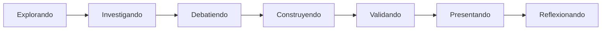

# 🎬 ETAPA 2 · CAPA DE EXPERIENCIA — Expedición ABP "El Taller"

> **Entregable previo a los wireframes.** Antes de dibujar una sola interfaz, definimos las 10
> capas de experiencia que convierten esto en un **Workspace colaborativo**, no en un sistema de
> pantallas. Sin código.
>
> **Cambio de mentalidad (rige todo el documento):**
> *No estamos diseñando una interfaz para hacer ABP. Estamos diseñando **el lugar donde ocurre el ABP**.*
>
> **Criterio de decisión (gate) para cada wireframe futuro:**
> *"¿Esto hace que un equipo tenga más ganas de reunirse aquí que en un Google Doc compartido?"*
> Si la respuesta no es un sí claro, el diseño no está listo.
>
> **Gobierna:** [PRODUCT_BIBLE_EXPEDICION.md](PRODUCT_BIBLE_EXPEDICION.md) (v1.0). Complementa:
> [UX_EXPEDICION_ETAPA2.md](UX_EXPEDICION_ETAPA2.md) (algunas partes de las que se **corrigen** aquí —
> ver §0.2). · Estado: borrador para aprobación · 2026-07-17.

---

## Tabla de contenido
- [0. De pantallas a lugar (el modelo espacial)](#0-de-pantallas-a-lugar-el-modelo-espacial)
- [1. Tipos de Instrumento (modalidades de apertura)](#1-tipos-de-instrumento-modalidades-de-apertura)
- [2. La Base → Cuartel General del equipo](#2-la-base--cuartel-general-del-equipo)
- [3. Crew System (presencia como sistema, no barra)](#3-crew-system-presencia-como-sistema-no-barra)
- [4. Estados pedagógicos del proyecto](#4-estados-pedagógicos-del-proyecto)
- [5. Gamificación integrada (no añadida)](#5-gamificación-integrada-no-añadida)
- [6. Valeria como IA contextual (no chat)](#6-valeria-como-ia-contextual-no-chat)
- [7. Ritmo narrativo (Modos de la Expedición)](#7-ritmo-narrativo-modos-de-la-expedición)
- [8. Experience Map (estudiante y docente)](#8-experience-map-estudiante-y-docente)
- [9. Decisión: Asíncrono-primero](#9-decisión-asíncrono-primero)
- [10. Gramática visual (color por intención)](#10-gramática-visual-color-por-intención)
- [11. Qué se promueve a la Biblia y qué sigue](#11-qué-se-promueve-a-la-biblia-y-qué-sigue)

---

## 0. De pantallas a lugar (el modelo espacial)

### 0.1 El nuevo modelo mental
Dejamos de pensar `Pantalla 1 → Pantalla 2 → Overlay → Pantalla 4`. Pensamos en un **lugar que se
habita**:
```
WORKSPACE   (el Taller: el lugar donde el equipo se reúne)
   ↓
PANELES     (regiones persistentes del lugar: presencia, trabajo, memoria, mentoría)
   ↓
HERRAMIENTAS (Instrumentos que se invocan en distintas modalidades)
   ↓
OBJETOS     (lo que se manipula: post-its, evidencias, votos, tareas…)
```
No se **navega** entre pantallas: se **entra a un lugar** y dentro se **sacan herramientas**. El
lugar no se recarga; cambian las herramientas activas y el foco.

### 0.2 Reconciliación con la Biblia
Esto **no contradice** la jerarquía académica de la Biblia (Expedición → Estaciones → Espacios →
Instrumentos → Artefactos). Son dos vistas del mismo sistema:
- **Jerarquía académica** = el *contenido* y el *progreso* (qué se aprende, cómo avanza).
- **Modelo espacial** = el *hábitat* (cómo se siente estar y trabajar ahí).

**Correcciones al UX (Etapa 2 previa)** que este documento oficializa:
1. La **Base** deja de ser un "home/portada" → es un **Cuartel General** (§2).
2. Los Instrumentos **no** abren todos como overlay → hay **5 modalidades** (§1).
3. La **Crew Bar** deja de ser "una barra" → es un **Crew System** de 5 subsistemas (§3).
4. Se añaden **estados pedagógicos** que modifican la interfaz, no solo el contenido (§4).

---

## 1. Tipos de Instrumento (modalidades de apertura)

> No todos los instrumentos deben comportarse igual. La **modalidad de apertura** es una propiedad
> declarada en el *Manifiesto de Instrumento* (Biblia §9). Elegir bien la modalidad es lo que hace
> que la UX se sienta natural en vez de "todo es un modal".

| Modalidad | Cuándo se usa | Comportamiento | Instrumentos ejemplo |
|---|---|---|---|
| **Overlay (foco)** | Trabajo expansivo que merece toda la atención del equipo | Entra al centro; atenúa el fondo pero no lo oculta; se sale con Esc/clic-fuera | **Brainstorm**, Mapa Mental |
| **Canvas completo** | Trabajo espacial grande y persistente | Ocupa toda el área de trabajo; pan/zoom/minimapa | **Canvas**, Kanban, Timeline, Cronograma, Diagramas |
| **Panel lateral** | Contenido de apoyo, consultable mientras se trabaja en otra cosa | Se ancla a un costado; convive con el instrumento principal | **Notas**, Comentarios, Checklist |
| **Bottom Sheet** | Acción puntual de entrada/captura, sobre todo táctil | Sube desde abajo; rápido; se descarta deslizando | **Adjuntar evidencia**, Grabar audio, Subir imagen |
| **Modal rápido / Popover** | Micro-decisión atómica | Pequeño, centrado o anclado; una sola acción; se cierra al confirmar | **Votar**, Confirmar, Nombrar (categoría) |

**Reglas:**
- La modalidad **la declara el manifiesto**, no se decide caso a caso en la UI.
- Un mismo motor de objeto puede exponerse en varias modalidades según el instrumento (p. ej.
  Evidencia se **captura** por Bottom Sheet pero se **consulta** en la Galería a Canvas completo).
- La modalidad debe respetar la regla de oro: **nunca "sacar" al estudiante del contexto de la
  estación** (el Taller sigue vivo detrás).

> **Impacto:** esto enriquece enormemente la UX y evita el "todo overlay". Se define **una vez** por
> instrumento y escala a los 60 futuros sin re-decidir.

---

## 2. La Base → Cuartel General del equipo

> La Base **no es un Home ni una portada.** El estudiante entra al proyecto muchas veces; no
> necesita una bienvenida, necesita saber **qué está pasando**. Es un **Cuartel General**: una sala
> de situación del equipo.

### 2.1 Lo primero que ve al entrar (ejemplo real)
```
Equipo Jaguar · Hoy
—————————————————————————
• Ana agregó dos ideas al Brainstorm
• Carlos espera aprobación de una propuesta
• Valeria dejó una sugerencia
• Falta una evidencia para validar El Terreno
• El docente revisará mañana
—————————————————————————
[ Continuar donde lo dejamos → ]
```

### 2.2 Qué muestra el Cuartel General (siempre orientado a la acción)
- **Estado del proyecto ahora**: en qué estación/estado pedagógico está el equipo (§4).
- **Qué pasó desde tu última visita**: actividad del equipo (Crew Activity — §3).
- **Qué te espera a ti**: lo que depende de este estudiante (aprobar, aportar, subir algo).
- **Qué falta para el siguiente Hito**: la brecha concreta hacia validar.
- **Qué dijo Valeria**: la sugerencia contextual pendiente (§6).
- **Qué sigue**: un único botón de continuidad ("Continuar donde lo dejamos"), no un menú.

### 2.3 Principios del Cuartel General
- **Glanceable**: se entiende en < 5 segundos, sin leer todo.
- **Diferencial**: registra "desde tu última visita" (no repite lo ya visto).
- **Un solo siguiente paso** (continuidad), no una portada con secciones.
- **Vivo**: si hay actividad reciente del equipo, se siente el pulso (no una pantalla estática).

---

## 3. Crew System (presencia como sistema, no barra)

> La presencia no es una barra de avatares: es un **sistema** con cinco subsistemas. Su trabajo es
> que el equipo **sienta** que está trabajando junto, incluso en asíncrono.

| Subsistema | Qué responde | Dónde vive | Señales |
|---|---|---|---|
| **Crew Presence** | ¿Quién está aquí ahora? | Barra persistente | avatares en línea, "viendo esta estación" |
| **Crew Activity** | ¿Qué está haciendo cada quien? | Barra + Cuartel General + Timeline | "escribiendo…", "movió un post-it", "votó", "subió evidencia" |
| **Crew Roles** | ¿Quién es responsable de qué? | Cuartel General + Kanban | Facilitador, Investigador, Constructor (vivos, ganados) |
| **Crew Progress** | ¿Cómo va el equipo? | Cuartel General + mapa | instrumentos completos, aportes por integrante, hacia el Hito |
| **Crew Mood** | ¿Cómo se siente el equipo? | Barra (sutil) + señal a Valeria | conectado, enfocado, frustrado, bloqueado, celebrando |

### 3.1 Crew Mood (el subsistema nuevo y diferencial)
- **Cómo se capta:** (a) auto-reporte ligero opcional (un tap: 🙂/😐/😟/🎉); (b) **inferencia de
  Valeria** a partir de señales reales (inactividad prolongada, reintentos, borrar y rehacer,
  bloqueo en un instrumento, ausencia de aportes de un integrante).
- **Cómo se muestra:** de forma **sutil y respetuosa** (nunca expone ni avergüenza a un estudiante).
  Es una temperatura del equipo, no un semáforo individual público.
- **Para qué sirve:** dispara la mentoría de Valeria (§6) y avisa al docente de equipos que
  necesitan un empujón (§8). *"Todos conectados, uno bloqueado, otro celebrando"* → Valeria actúa.

> Crew Mood convierte la presencia en una **experiencia viva**: el sistema no solo sabe quién está,
> sino **cómo está** el equipo.

---

## 4. Estados pedagógicos del proyecto

> Además de los estados **técnicos** (LOCKED / IN_PROGRESS / AWAITING / VALIDATED), existe una capa
> de estados **pedagógicos**: el *modo de trabajo* del equipo. La interfaz **cambia ligeramente**
> según el estado (no solo el contenido).



| Estado pedagógico | Qué hace el equipo | Cómo cambia la interfaz |
|---|---|---|
| **Explorando** | Diverge, genera, recoge | Tono expansivo y lúdico; instrumentos de Exploración al frente; animaciones sueltas |
| **Investigando** | Busca información, evidencia | Foco en Documentación/Evidencias; entra material externo; ritmo calmo |
| **Debatiendo** | Discute, vota, prioriza | Aparece el ConvergePanel; se resaltan votos y decisiones; tono de acuerdo |
| **Construyendo** | Fabrica la solución/plan | Modo Canvas completo; Kanban/Cronograma protagonistas; energía "manos a la obra" |
| **Validando** | Cierra y presenta al docente | Compuerta encendida; resumen del artefacto; tono ceremonial |
| **Presentando** | Muestra a otros equipos (Ágora) | Modo vitrina; presencia de otros equipos; foco en la solución |
| **Reflexionando** | Mira atrás, aprende | Timeline y Artefactos Vivos al frente; tono sereno; Valeria resume aprendizajes |

**Relación con lo técnico:** los estados pedagógicos son más finos que las 6 estaciones; una
estación puede pasar por varios (p. ej. El Terreno: Explorando → Investigando → Debatiendo →
Validando). El estado técnico gobierna el **avance**; el pedagógico gobierna el **tono**.

---

## 5. Gamificación integrada (no añadida)

> No hablamos de puntos: hablamos de **momentos**. La gamificación es parte del tejido de la
> experiencia, no una pestaña de trofeos. Es **de equipo**, sobria y narrativa.

### 5.1 Familias de momentos
- **Descubrimientos** — surgir un insight con narrativa: *"Equipo Jaguar ha descubierto **una causa
  raíz**"* con una animación breve. Se disparan cuando el trabajo alcanza algo con sentido
  pedagógico (una causa raíz en el Árbol, una idea ganadora clara, la primera evidencia real).
- **Hitos** — cierre de estación validada (Biblia §7): sello + celebración.
- **Insignias / Sellos** — colección visible en el mapa; cara de los Hitos.
- **Rachas** — días consecutivos con actividad de ≥2 integrantes (constancia colectiva).
- **Desbloqueos** — nuevas estaciones/instrumentos que se abren (con animación de "se abre el candado").
- **Celebraciones** — micro (aporte, tablero completo) y macro (Hito, cima).
- **Narrativa** — todo lo anterior se **cuenta** en el Timeline como historia del equipo.

### 5.2 Reglas
- **Se dispara en el flujo**, donde ocurre el logro; nunca en una pantalla aparte.
- **De equipo, no de ranking individual** (no enfrenta a los estudiantes).
- **Sobria**: refuerza, no infantiliza; respeta `prefers-reduced-motion`.
- **Con significado pedagógico**: se celebra el *proceso de pensar*, no el clic.

---

## 6. Valeria como IA contextual (no chat)

> Valeria **no es un chat que se abre**: es una presencia **contextual** que aparece **donde tiene
> sentido**, ligada a lo que el estudiante está haciendo. Acompaña, no reemplaza (Biblia §13).

### 6.1 Aparece en contexto (ejemplos)
| El estudiante está… | Valeria susurra… | Acción ofrecida |
|---|---|---|
| Escribiendo una idea | "¿Quieres convertir esta idea en una tarea?" | Convertir (Instrumento Inteligente) |
| Haciendo Brainstorm | "He detectado tres ideas repetidas." | Agrupar / deduplicar |
| Llenando un Canvas | "Falta el segmento de clientes." | Ir al campo faltante |
| Estancado (Crew Mood: bloqueado) | "¿Les propongo un siguiente paso?" | Ver sugerencia |
| Cerrando la estación | "Resumí sus acuerdos, ¿los guardo en la Bitácora?" | Guardar en Timeline |

### 6.2 Superficie y reglas
- **Susurro contextual** (whisper): una tarjeta discreta anclada a lo que se hace, no un panel que
  tapa el trabajo. Aparece, se puede **Aplicar** o **Descartar**, y se va.
- **Nunca auto-aplica**: el equipo decide; toda acción de Valeria es reversible y queda atribuida en
  el Timeline como "Valeria + equipo".
- **No interrumpe el flujo**: espera un momento natural (pausa, fin de un aporte), no mientras se escribe.
- **Sin "abrir la IA"**: no hay que ir a buscarla; llega donde importa. (Existe un acceso explícito
  opcional vía Command Bar para pedirle algo, pero el modo principal es contextual.)

---

## 7. Ritmo narrativo (Modos de la Expedición)

> Un proyecto tiene **ritmo**. Hay días de explorar, días de construir, días de presentar. La
> interfaz debe **transmitir el momento** — emocionalmente, no solo funcionalmente.

Los **Modos** son la piel emocional/atmosférica del Taller. Se derivan del estado pedagógico (§4)
pero operan a nivel de *sensación*:

| Modo | Momento | Atmósfera (temperatura, movimiento, densidad) |
|---|---|---|
| **Exploración** | divergir, generar | cálido y luminoso; movimiento suelto; baja densidad, mucho aire |
| **Construcción** | fabricar, planear | enfocado y sólido; movimiento preciso; densidad media, herramientas robustas |
| **Presentación** | mostrar al Ágora | claro y protagónico; movimiento escénico; foco en el artefacto |
| **Celebración** | Hito, cima | festivo y breve; movimiento expresivo; confeti sobrio, luz cálida |
| **Reflexión** | mirar atrás | sereno y tenue; movimiento lento; foco en memoria/Timeline |

**Reglas:** el Modo cambia **sutilmente** (temperatura de color, energía de las animaciones,
densidad), nunca al punto de desorientar. Es el mismo Taller "en otra hora del día". Respeta la
gramática visual (§10) y `prefers-reduced-motion`.

---

## 8. Experience Map (estudiante y docente)

> Antes de wireframes, mapeamos **qué siente** cada rol a lo largo del ciclo. Diseñamos para esas
> emociones, no solo para las tareas.

### 8.1 Semana del estudiante (Equipo Jaguar)
| Día | Hace | Estado pedagógico | Siente | La interfaz enfatiza |
|---|---|---|---|---|
| **Lunes** | Entra, conoce el reto, primeras ideas | Explorando | Curiosidad, energía | Cuartel General + Brainstorm; Modo Exploración |
| **Martes** | Recoge información y evidencias | Investigando | Enfoque, propósito | Documentación/Evidencias; ritmo calmo |
| **Miércoles** | Debate, vota, decide | Debatiendo | Tensión sana, acuerdo | ConvergePanel; votos y decisiones |
| **Jueves** | Construye el plan/prototipo | Construyendo | Flow, "manos a la obra" | Canvas completo, Kanban; Modo Construcción |
| **Viernes** | Presenta y valida | Validando → Presentando | Orgullo, nervios buenos | Compuerta, Ritual, Ágora; Modo Presentación |
| **(cierre)** | Celebra el Hito y reflexiona | Reflexionando | Logro, pertenencia | Celebración + Timeline; Modo Reflexión |

### 8.2 Ciclo del docente
| Momento | Hace | Siente | La interfaz enfatiza |
|---|---|---|---|
| Antes | Monta la expedición, arma equipos, elige instrumentos/plantillas | Preparación | Sala de Control (montaje), Biblioteca de Plantillas |
| Durante | Observa, detecta baja participación, hace *nudge* | Vigilancia acompañante | Grid de equipos, Crew Mood, alertas ⚠️ |
| Hitos | Valida con rúbrica o devuelve con feedback | Juicio justo | Cola de validación, rúbrica, feedback anclado |
| Cierre | Orquesta el Ágora, consolida | Cierre, celebración | Ágora, coevaluación, consolidado |

> El Experience Map es la brújula emocional: cada wireframe debe **honrar la emoción del momento**,
> no solo permitir la tarea.

---

## 9. Decisión: Asíncrono-primero

> **Decisión arquitectónica que se toma AHORA, antes de diseñar una pantalla** (cambia todo).

**Pregunta:** ¿la Expedición es síncrona o asíncrona?
**Respuesta (congelada):** **Asíncrono-primero. El tiempo real es un enriquecimiento, no un requisito.**

### 9.1 Por qué
- La realidad del aula es mayoritariamente **asíncrona**: los estudiantes entran en momentos
  distintos, desde casa, en clases distintas.
- Diseñar asíncrono-primero garantiza que la experiencia **funcione aun cuando solo hay una persona
  conectada** (el estado "sin compañeros" es de primera clase, no un caso borde).
- El tiempo real (cursores, co-edición viva) **suma magia** cuando coincide el equipo, pero **no
  debe ser la condición** para que el Taller se sienta vivo.

### 9.2 Consecuencias de diseño
- **La columna vertebral es asíncrona:** Timeline narrativo (§Biblia 12), Crew Activity (§3),
  Comentarios, autoría por objeto, "desde tu última visita" (§2). Todo esto hace sentir compañía
  **sin nadie más en línea**.
- **El tiempo real es aditivo (N2):** Crew Presence en vivo, "escribiendo…", cursores con nombre,
  reacciones efímeras. La UI se diseña para acomodarlo, pero se lanza sin él.
- **Regla:** ninguna función crítica (aportar, validar, ver el trabajo del equipo) puede requerir
  que otro esté conectado al mismo tiempo.

---

## 10. Gramática visual (color por intención)

> No es UI: es **gramática**. Un lenguaje de color que permite **leer la interfaz sin leer**. El
> estudiante entiende "esto es construir", "esto es IA", "esto es del equipo" por el color, antes de
> leer una palabra.

### 10.1 Colores por intención (familias de trabajo)
| Intención | Significado | Uso |
|---|---|---|
| **Explorar / Descubrir** | divergir, generar | tiñe los espacios/instrumentos de Exploración |
| **Analizar** | ordenar, comprender | espacios/instrumentos de Análisis |
| **Decidir** | acordar, comprometerse | ConvergePanel, votaciones, decisiones |
| **Construir** | fabricar, planear | Canvas, Kanban, Cronograma |
| **Documentar** | registrar, evidenciar | Galería, Notas, Evidencias |
| **Validar** | cerrar, aprobar | Compuerta, Ritual, sellos |

### 10.2 Colores de identidad (constantes, siempre significan lo mismo)
| Identidad | Significado | Regla |
|---|---|---|
| **Valeria / IA** | "otra voz que acompaña" | un color propio y constante para TODO lo de IA; nunca se usa para otra cosa |
| **Equipo / Presencia** | "esto es de tu gente" | color constante para presencia, autoría, Crew System |

### 10.3 Disciplina (para que no sea caos de color)
- **Jerarquía clara:** *Color de estación* = **dónde estás** (wayfinding, marco sutil). *Color de
  intención* = **qué tipo de trabajo** (domina el espacio actual). *Valeria* y *Equipo* = **voces
  constantes**.
- **Una intención dominante por espacio**: en un momento dado, un espacio muestra su color de
  familia; no compiten seis colores en pantalla.
- **Los semánticos** (válido/aviso/error) son independientes y no cuentan como acento.
- La paleta base y los dos temas siguen siendo los de la Biblia §14; esta gramática es una **capa
  semántica encima**, no una paleta nueva.

> Resultado: el estudiante "entiende la interfaz sin leer". El color hace la mitad de la explicación.

---

## 11. Qué se promueve a la Biblia y qué sigue

### 11.1 Amendas a promover a la Biblia (v1.1, tras aprobación)
Estas decisiones son arquitectónicas y deben vivir en la fuente de verdad:
- **Tipos de Instrumento / modalidades de apertura** (§1) → nuevo campo del Manifiesto (Biblia §9).
- **Base = Cuartel General** (§2) → redefinir la P1 en la Biblia.
- **Crew System de 5 subsistemas** (§3) → ampliar Biblia §11.
- **Estados pedagógicos + Modos** (§4, §7) → nueva capa junto a los estados técnicos.
- **Asíncrono-primero** (§9) → decisión de arquitectura en Biblia §16.
- **Gramática visual** (§10) → ampliar Biblia §14.
- **Valeria contextual** (§6) e **IA como Instrumento Inteligente en contexto** → precisar Biblia §13.

### 11.2 Checklist de salida (las 10 decisiones que pediste)
- [ ] 1 · Taxonomía de tipos de Instrumento y su comportamiento (§1)
- [ ] 2 · Base → Cuartel General (§2)
- [ ] 3 · Crew System (§3)
- [ ] 4 · Estados pedagógicos (§4)
- [ ] 5 · Gamificación integrada (§5)
- [ ] 6 · Valeria contextual (§6)
- [ ] 7 · Ritmo narrativo / Modos (§7)
- [ ] 8 · Experience Map estudiante + docente (§8)
- [ ] 9 · Estrategia asíncrona/síncrona (§9 — decidido: asíncrono-primero)
- [ ] 10 · Gramática visual (§10)

### 11.3 Recién entonces: Wireframes
Con estas 10 capas aprobadas, los wireframes se dibujarán **respondiendo siempre** a la pregunta
gate: *"¿Esto hace que un equipo tenga más ganas de reunirse aquí que en un Google Doc compartido?"*

---

> **Fin de la Capa de Experiencia.** No se dibuja un wireframe hasta aprobar estas 10 decisiones y
> promover las amendas a la Biblia (v1.1). Seguimos sin escribir código.
