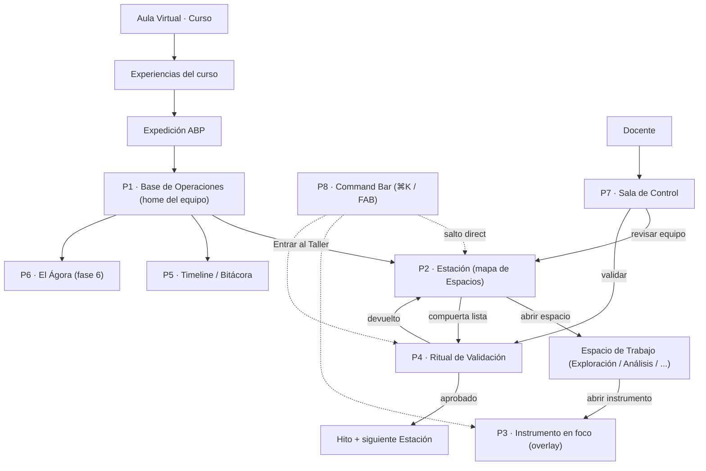
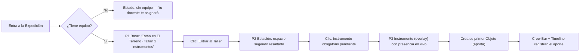
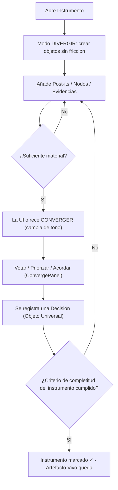
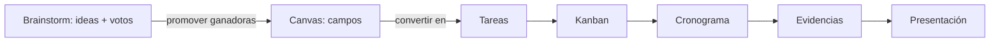
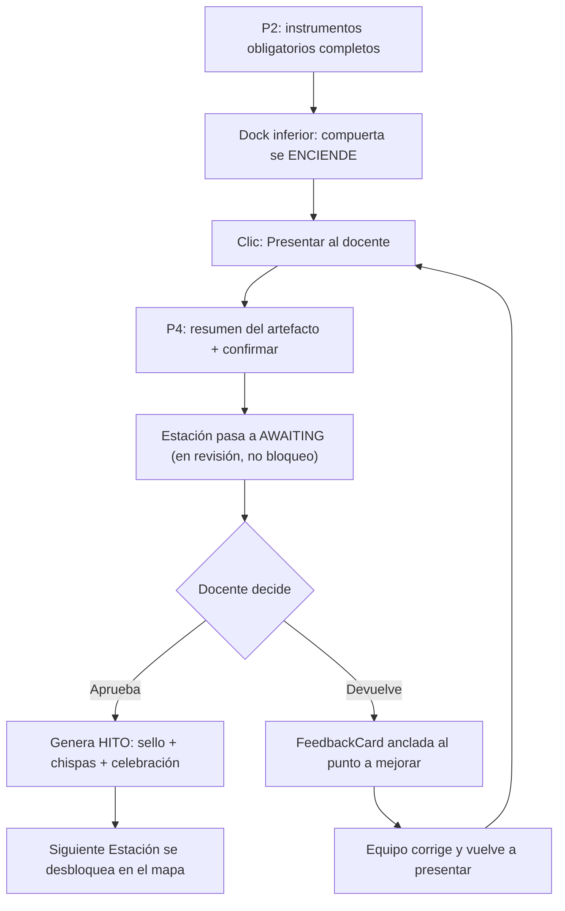
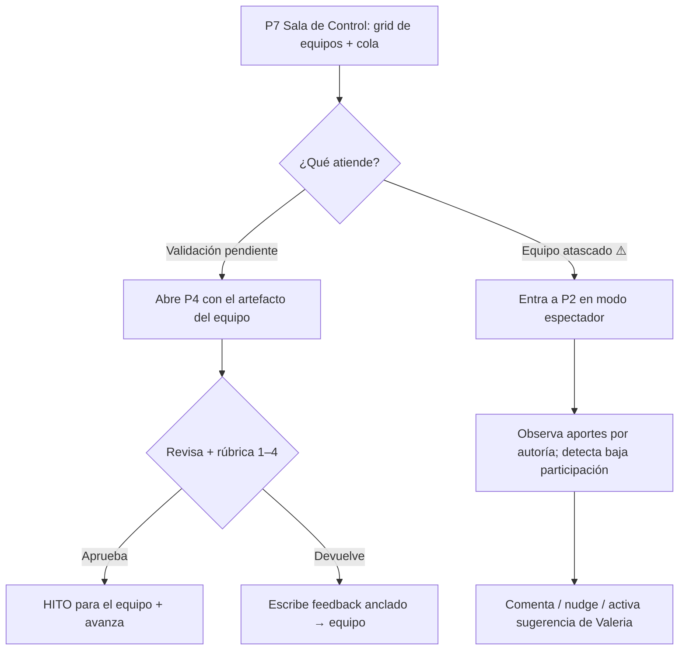
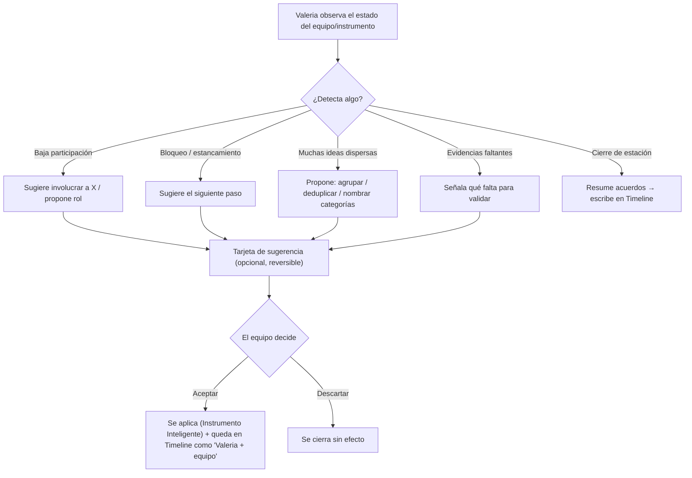

# 🧭 ETAPA 2 · DISEÑO UX — Expedición ABP "El Taller"

> **Primer entregable de la Etapa 2.** Define el **comportamiento** del módulo: navegación,
> flujos, modelo de interacción y estados. **No es diseño visual** (eso viene después) ni
> wireframes de layout (siguiente paso). Es el blueprint que hace que todo lo demás sea coherente.
>
> **Gobierna:** [PRODUCT_BIBLE_EXPEDICION.md](PRODUCT_BIBLE_EXPEDICION.md) (v1.0, congelada). Este
> documento no puede contradecirla; la implementa.
>
> **Sin código.** Orden de la Etapa 2: **UX (este doc) → Wireframes → Diseño visual → Prototipos →
> Responsive → Interacciones.**
>
> **Estado:** borrador para aprobación · 2026-07-17.

---

## Tabla de contenido
- [0. Alcance y método](#0-alcance-y-método)
- [1. Principios de UX (reglas de interacción)](#1-principios-de-ux-reglas-de-interacción)
- [2. Mapa de navegación](#2-mapa-de-navegación)
- [3. Inventario de pantallas](#3-inventario-de-pantallas)
- [4. Flujos del estudiante](#4-flujos-del-estudiante)
- [5. Flujos del docente](#5-flujos-del-docente)
- [6. Flujo de Valeria (mentora)](#6-flujo-de-valeria-mentora)
- [7. Modelo de interacción (patrones)](#7-modelo-de-interacción-patrones)
- [8. Jerarquía de acciones (la "decisión siguiente")](#8-jerarquía-de-acciones-la-decisión-siguiente)
- [9. Estados por pantalla](#9-estados-por-pantalla)
- [10. UX Responsive (comportamiento por dispositivo)](#10-ux-responsive-comportamiento-por-dispositivo)
- [11. Mantener el contexto del Aula](#11-mantener-el-contexto-del-aula)
- [12. Checklist de salida hacia Wireframes](#12-checklist-de-salida-hacia-wireframes)

---

## 0. Alcance y método

**Qué define este documento:**
- Cómo se **mueve** el usuario (navegación) sin salir del Aula Virtual.
- Los **flujos** de las tareas clave (estudiante, docente, Valeria).
- El **modelo de interacción**: cómo se abren instrumentos, se crean objetos, se converge, se valida.
- Qué **estados** debe manejar cada pantalla.
- El comportamiento **responsive** (a nivel de UX, no de píxeles).

**Qué NO define (todavía):** layout visual, tipografía aplicada, color final, componentes pixel-perfect.

**Pantallas núcleo** (del §7/§10 de la Biblia):
`Entrada del Aula` · `P1 Base de Operaciones` · `P2 Estación` · `P3 Instrumento` ·
`P4 Ritual de Validación` · `P5 Timeline` · `P6 El Ágora` · `P7 Sala de Control (docente)` ·
`P8 Command Bar`.

---

## 1. Principios de UX (reglas de interacción)

Traducción de los principios de la Biblia a reglas de comportamiento verificables:

1. **≤ 2 clics** entre "entro" y "estoy aportando con mi equipo".
2. **Siempre hay una acción primaria evidente** en pantalla (la "decisión siguiente" — §8).
3. **Abrir un Instrumento nunca es navegar a otra página**: es un overlay/foco que conserva el
   contexto de la estación detrás.
4. **Nunca se pierde el contexto del curso** (breadcrumb Curso › Experiencia › Expedición › Estación).
5. **Toda acción con el equipo deja rastro visible** (Crew Bar + Timeline) en < 1 s.
6. **El error nunca bloquea el trabajo**: autosave, offline tolerante, reintento silencioso.
7. **Converger es un momento explícito**, no un botón perdido: la UI cambia de "crear" a "decidir".
8. **La información fluye entre instrumentos**: mover un objeto = 1 gesto, no recapturar.
9. **Valeria sugiere, el equipo decide**: toda propuesta de IA es opcional, reversible y atribuida.

---

## 2. Mapa de navegación

El estudiante entra **desde el Aula Virtual**, dentro de un curso. La Expedición es una Experiencia
del curso. Todo ocurre embebido; nunca hay "pantalla completa" que rompa el marco del Aula.

**Reglas de navegación:**
- La **Base** es el punto de retorno seguro; siempre se puede volver a ella.
- El **Command Bar (⌘K / FAB)** es un atajo transversal: salta a cualquier estación/instrumento sin
  navegar en cascada.
- **P3 (Instrumento)** es siempre un **overlay sobre P2**, nunca una ruta nueva de página.
- El docente entra por **P7** y "baja" a la estación de un equipo en modo espectador.

---

## 3. Inventario de pantallas

Cada pantalla tiene UN trabajo. Entrada, salida, acción primaria y componentes clave (del ecosistema §10).

| Pantalla | Job (una frase) | Se entra desde | Acción primaria | Componentes clave | Salida |
|---|---|---|---|---|---|
| **Entrada Aula** | Elegir la Expedición del curso | Experiencias del curso | "Abrir Expedición" | breadcrumb, tarjeta de experiencia | → P1 |
| **P1 Base** | Saber dónde estamos y entrar a trabajar | Entrada / retorno | "Entrar al Taller →" | Expedition Map, Crew Bar, pulso, Timeline peek | → P2 / P5 |
| **P2 Estación** | Elegir en qué espacio/instrumento trabajar | P1 / Command Bar | abrir el instrumento sugerido | Panel espacios, InstrumentCards, Dock inferior (compuerta), Crew Bar, Mini Mapa | → P3 / P4 |
| **P3 Instrumento** | Construir el artefacto con el equipo | P2 / Command Bar | crear/editar un Objeto | Canvas, Dock superior (dinámica), Panel derecho (inspector), Crew Bar | → P2 (cerrar foco) |
| **P4 Ritual Validación** | Presentar el artefacto al docente | Dock inferior de P2 | "Presentar al docente" | resumen del artefacto, compuerta, estado de espera | → Hito / P2 |
| **P5 Timeline** | Recordar cómo construimos | P1 / Crew Bar | leer/filtrar la memoria | Timeline narrativo | → P1 |
| **P6 El Ágora** | Presentar y coevaluar entre equipos | P1 (fase 6) | presentar / coevaluar | Vitrina, Coevaluación | → P1 |
| **P7 Sala de Control** | Ver todos los equipos y validar | Vista docente | atender la cola de validación | grid de equipos, cola, señales de alerta | → P2 (espectador) / P4 |
| **P8 Command Bar** | Ir/actuar sin navegar | ⌘K / FAB (cualquier lugar) | ejecutar el comando elegido | lista de comandos, búsqueda | vuelve al origen |

---

## 4. Flujos del estudiante

### F1 · Llegada y primer aporte *(la prueba de los ≤ 2 clics)*

### F2 · Trabajar un Instrumento: divergir → converger

### F3 · Flujo entre Instrumentos *(la info fluye, no se copia)*

UX: al promover, aparece un gesto **"Enviar a → [instrumento]"** que **referencia** el mismo Objeto
Universal (no lo duplica). El destino muestra los objetos entrantes marcados como "provenientes de…".

### F4 · Ritual de Validación → Hito

---

## 5. Flujos del docente

### F5 · Sala de Control → validar / devolver

Nota: el docente trabaja en **densidad** (tablero, cola, rúbrica); el estudiante en **espacio**
(lienzo). Dos gramáticas distintas para dos trabajos distintos.

---

## 6. Flujo de Valeria (mentora)

Valeria **acompaña**, nunca reemplaza. Interviene con tacto y sus aportes quedan atribuidos.

---

## 7. Modelo de interacción (patrones)

Patrones reutilizables. Se definen una vez y valen para todo instrumento (coherencia + escala).

| Patrón | Cómo funciona (UX) |
|---|---|
| **Abrir instrumento** | Clic en InstrumentCard → overlay entra desde el centro; el fondo (estación) se atenúa pero sigue visible. Cerrar = Esc / clic fuera / flecha. |
| **Crear un Objeto** | Acción primaria del Dock superior (o doble-clic en el Canvas / tecla `N`). El objeto "cae" en el lienzo con autoría propia. |
| **Editar un Objeto** | Clic para seleccionar → edición inline; el Panel derecho muestra detalle (autor, votos, comentarios, adjuntos). |
| **Elegir Dinámica** | Al abrir un Instrumento, se ofrece la Dinámica (Brainstorm, Crazy 8, 5 Porqués…). Cambiar de dinámica reconfigura la guía, no los datos. |
| **Partir de Plantilla** | Al crear el instrumento (docente) o al abrirlo vacío: "desde cero" o "elegir plantilla". |
| **Converger** | Cuando hay material, aparece el **ConvergePanel** (votar/priorizar/acordar). Produce una **Decisión**. |
| **Mover info entre instrumentos** | Selección → "Enviar a →"; el objeto se referencia en el destino (no se copia). |
| **Presencia** | Avatares en Crew Bar; "escribiendo…" en el instrumento; aporte ajeno aparece con animación + autoría. |
| **Comentar** | Cualquier objeto → botón comentar → hilo en Panel derecho. |
| **Sugerencia de Valeria** | Tarjeta no intrusiva en una esquina; acciones "Aplicar" / "Descartar"; nunca auto-aplica. |
| **Command Bar** | `⌘K` (desktop) / FAB (táctil) → buscar y ejecutar (ir a estación, abrir instrumento, invocar Valeria, presentar). |
| **Validar** | Compuerta en Dock inferior; se enciende sola al cumplir obligatorios; abre el Ritual. |

---

## 8. Jerarquía de acciones (la "decisión siguiente")

Cada pantalla declara **una** acción primaria (siempre visible) + secundarias (repliegan). Así el
estudiante nunca se queda sin saber qué hacer.

| Pantalla | Acción primaria | Secundarias |
|---|---|---|
| **P1 Base** | Entrar al Taller → | Ver Timeline · ver equipo · Manual |
| **P2 Estación** | Abrir el instrumento obligatorio pendiente | Explorar otros espacios · pedir a Valeria · Presentar (si listo) |
| **P3 Instrumento** | Crear/aportar un Objeto | Converger · comentar · enviar a → · cerrar foco |
| **P4 Ritual** | Presentar al docente | Todavía no · revisar artefacto |
| **P7 Docente** | Atender la siguiente validación de la cola | Entrar a un equipo · filtrar · alertas |

**Regla:** si al diseñar una pantalla no se identifica su acción primaria única, la pantalla no está lista.

---

## 9. Estados por pantalla

Matriz de qué estados (del catálogo universal §15 de la Biblia) debe soportar cada pantalla.
Leyenda: ✅ obligatorio · — no aplica.

| Estado | P1 Base | P2 Estación | P3 Instrumento | P4 Ritual | P7 Docente |
|---|:--:|:--:|:--:|:--:|:--:|
| Vacío | ✅ (sin equipo) | ✅ (sin instrumentos) | ✅ (lienzo vacío) | — | ✅ (sin equipos) |
| Nuevo | ✅ | ✅ | ✅ | — | ✅ |
| Colaborando | ✅ | ✅ | ✅ | — | — |
| Editando | — | — | ✅ | — | — |
| Esperando | ✅ (fase en revisión) | ✅ (AWAITING) | ✅ (solo lectura) | ✅ | ✅ (cola) |
| Validado | ✅ (Hito) | ✅ | ✅ | ✅ | ✅ |
| Bloqueado | — | ✅ (LOCKED) | ✅ (no-miembro) | ✅ (faltan oblig.) | — |
| Error | ✅ | ✅ | ✅ | ✅ | ✅ |
| Offline | ✅ | ✅ | ✅ | ✅ | ✅ |
| Sin compañeros | ✅ | ✅ | ✅ | — | — |

---

## 10. UX Responsive (comportamiento por dispositivo)

Mismo modelo mental, tres comportamientos. El **contenido y los objetos son los mismos**; cambia la
manipulación.

| | **Desktop** | **Tablet** (dispositivo del aula) | **Móvil** |
|---|---|---|---|
| **P2 Estación** | Mapa de espacios + instrumentos en rejilla | Igual, táctil, tarjetas grandes | Espacios apilados (acordeón vertical) |
| **P3 Instrumento** | **Canvas 2D** (pan/zoom/minimapa), overlay | **Canvas táctil** a pantalla completa (pinch/drag) | **Cajón vertical**: lista de objetos + editor guiado por pasos (no board libre) |
| **Crear objeto** | Doble-clic / tecla `N` | Tocar "+" / long-press | FAB "+" / cámara para evidencias |
| **Command Bar** | ⌘K | FAB "✦" | FAB "✦" + Bottom Sheet |
| **Converger** | ConvergePanel lateral | ConvergePanel a pantalla | Bottom Sheet |
| **Validación** | Dock inferior flotante | Dock inferior | Barra inferior fija (sticky) |
| **Lienzos complejos** (Árbol, Diagramas) | edición libre | edición libre | **modo lectura** + edición guiada por pasos |

Regla: en móvil **no** se fuerza el lienzo libre; se degrada a lista/guía. Aportar rápido (post-it,
voto, foto) debe funcionar perfecto en móvil.

---

## 11. Mantener el contexto del Aula

La Expedición **vive dentro del Aula** (Biblia §1). A nivel UX:
- **Breadcrumb persistente:** `Curso › Experiencias › Expedición › Estación · Espacio`. Siempre
  clicable para volver sin perder contexto.
- **Sin pantalla completa que "expulse"** del Aula: los overlays de instrumento viven dentro del
  marco del curso.
- **Sesión, avatar, permisos y notificaciones** son los del Aula (no hay onboarding ni login propio).
- **Volver al Aula** siempre a un clic desde el breadcrumb; volver a la Expedición reabre en el
  último punto (la estación/instrumento donde estaba).
- El equipo y los estudiantes son los **del curso** (roster de matriculados); nunca se crean aparte.

---

## 12. Checklist de salida hacia Wireframes

Antes de pasar a **Wireframes** (siguiente paso de Etapa 2), este UX debe cumplir:

- [ ] Mapa de navegación aprobado (§2).
- [ ] Cada pantalla núcleo tiene job, acción primaria y estados definidos (§3, §8, §9).
- [ ] Los 4 flujos de estudiante + docente + Valeria validados (§4–§6).
- [ ] Patrones de interacción acordados (§7) — sobre todo: abrir instrumento, crear objeto,
      converger, flujo entre instrumentos, sugerencia de Valeria.
- [ ] Comportamiento responsive definido para P2 y P3 (§10).
- [ ] Reglas de contexto del Aula confirmadas (§11).

Cuando esté aprobado, el siguiente entregable serán los **wireframes de baja fidelidad** de:
`P1 Base`, `P2 Estación`, `P3 Instrumento` (con un instrumento ejemplo: Brainstorm), `P4 Ritual`,
`P7 Sala de Control` — cada uno con sus estados clave.

---

> **Fin del entregable de Diseño UX.** Alimenta los Wireframes. No se escribe código hasta terminar
> toda la Etapa 2. Gobierna la Biblia v1.0.
