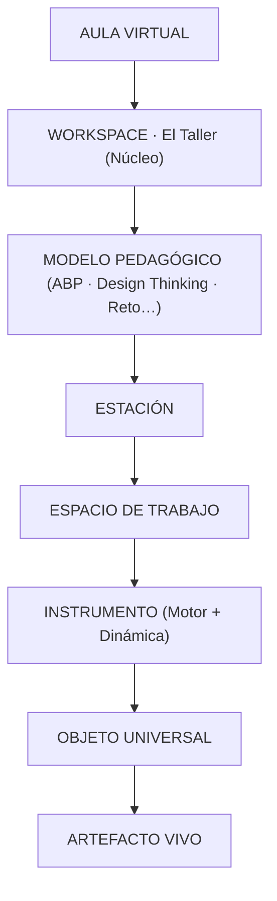
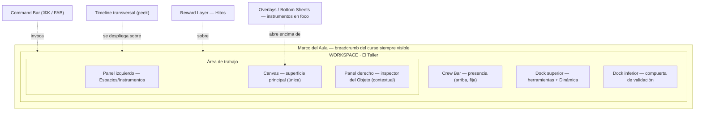
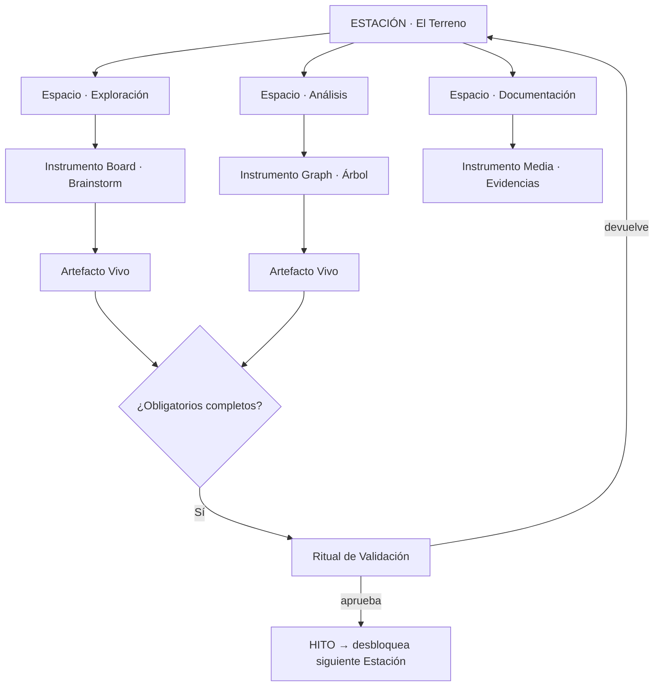
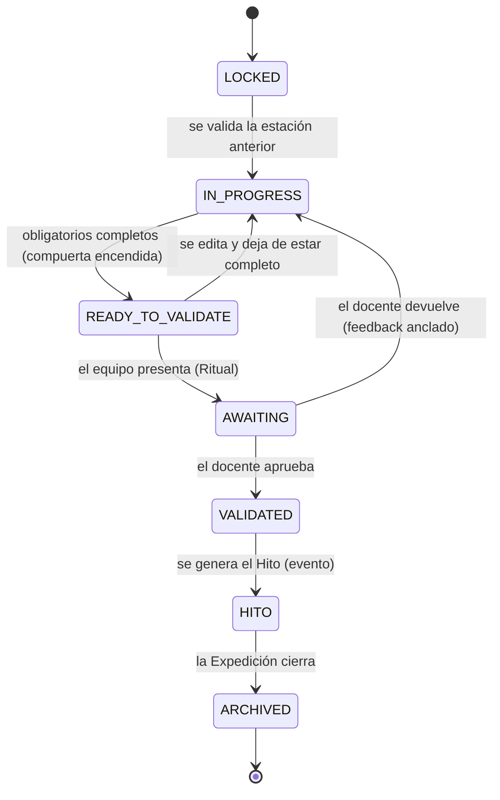
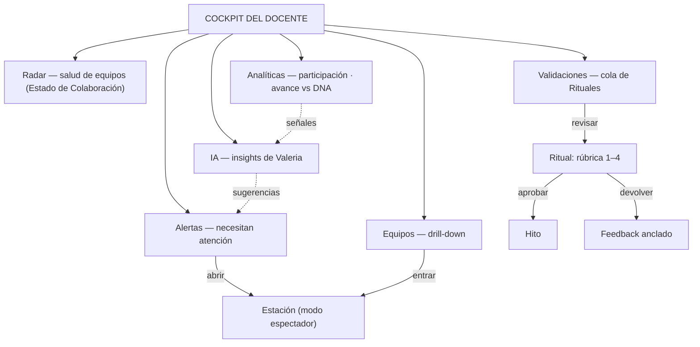
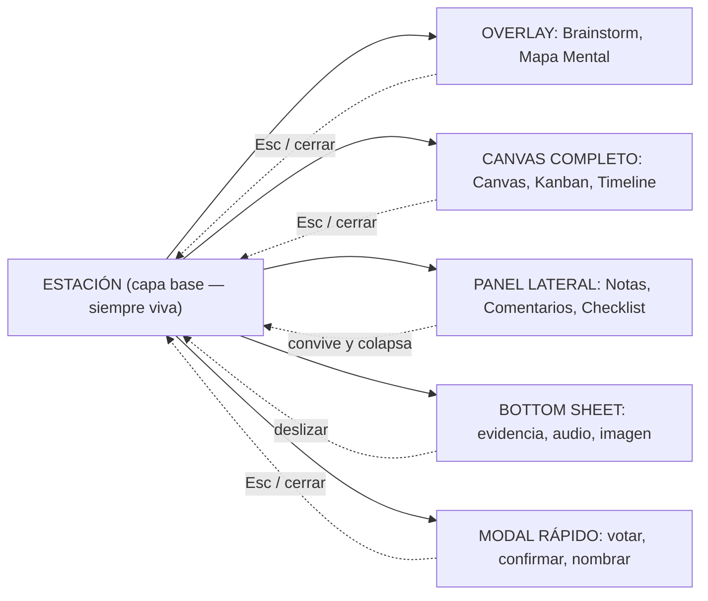

# 🗺️ ETAPA 2 · WIREFRAMES DEL SISTEMA — El Taller (arquitectura espacial)

> **Fase corta previa a los wireframes de interfaz.** No dibujamos pantallas: dibujamos **cómo se
> relacionan los componentes** (la arquitectura espacial del producto). Con esta base, los
> wireframes de alta fidelidad fluyen con coherencia.
>
> **Marco mental:** el Taller se comporta como un **sistema operativo para el aprendizaje
> colaborativo** — tiene **objetos, eventos, superficies, capas, persistencia, memoria, procesos y
> herramientas**. No es una colección de pantallas.
>
> **Gobierna:** [PRODUCT_BIBLE_EXPEDICION.md](PRODUCT_BIBLE_EXPEDICION.md) v2.0 (congelada). Este
> documento la **implementa espacialmente**, no la modifica. · Estado: borrador · 2026-07-17.
>
> **Gate permanente:** *"¿Esto hace que un equipo tenga más ganas de reunirse aquí que en un Google
> Doc compartido?"*

**Contenido:**
- [A. Conceptos transversales](#a-conceptos-transversales) (Núcleo · Superficies · Niveles de navegación · Principios espaciales · Regla del Canvas · Persistencia)
- [B. Los mapas](#b-los-mapas) (0 Objeto · 1 Jerarquía · 2 Workspace · 3 Estación · 4 Ciclo de vida · 5 Docente · 6 Aperturas)
- [C. Anatomía del Taller (la lámina)](#c-anatomía-del-taller-la-lámina)
- [Anexo · Backlog de 4 Bibles](#anexo--backlog-acordado-4-bibles-complementarias)

---

# A. Conceptos transversales

## A.1 Núcleo → Motores → Instrumentos → Experiencias
Adoptamos la palabra **Núcleo** para nombrar el corazón reutilizable del sistema. Ayuda a pensar la
arquitectura:
```
NÚCLEO         (objetos, relaciones, eventos, superficies, persistencia, Crew, Timeline)
   ↓
MOTORES        (~10 fundaciones: Board, Graph, Cards, Flow, Timeline, Matrix, Poll, Frame, Doc, Media)
   ↓
INSTRUMENTOS   (motores configurados + dinámica)
   ↓
EXPERIENCIAS   (modelos pedagógicos montados sobre todo lo anterior: ABP, Design Thinking, Reto…)
```
El **Núcleo** no sabe de pedagogía; las **Experiencias** no saben de bajo nivel. Esa distancia es lo
que convierte al Taller en un **producto**, no en un módulo.

## A.2 Superficies (término paraguas)
Unificamos Panel, Canvas, Overlay, Bottom Sheet, Modal y Dock bajo un solo concepto: **Superficie**.
```
WORKSPACE → SUPERFICIES → { Canvas · Panel · Dock · Overlay · Bottom Sheet · Modal }
```
- **Superficie principal:** el Canvas (el área de trabajo). Solo puede haber **una** a la vez.
- **Superficies persistentes:** Crew Bar, Docks (marco del lugar).
- **Superficies invocables/efímeras:** Overlay, Bottom Sheet, Modal, Command Bar, Timeline peek.
Hablar de "Superficies" simplifica toda la documentación y las reglas (A.4).

## A.3 Niveles de navegación (para breadcrumbs)
Cinco niveles nombrados. El breadcrumb siempre refleja dónde estás sin perder el contexto del curso.
```
Nivel 1 · Curso
Nivel 2 · Experiencia (Expedición)
Nivel 3 · Estación
Nivel 4 · Espacio de Trabajo
Nivel 5 · Instrumento
```
Breadcrumb tipo: `Curso › Expedición Ríos Limpios › El Terreno › Exploración › Brainstorm`.

## A.4 Principios espaciales (5 reglas)
Reglas pequeñas que evitan inconsistencias futuras:
1. **Una sola superficie principal** a la vez (un solo Canvas activo).
2. **Nunca dos overlays** simultáneos.
3. **Nunca dos focos** compitiendo por la atención.
4. **Siempre existe una ruta de retorno** (nunca un callejón sin salida).
5. **Todo puede cerrarse con Esc** (y con un gesto equivalente en táctil).

## A.5 Regla del Canvas (explícita)
> **El Canvas nunca es un lienzo vacío.** Siempre muestra al menos una de: **contexto · guía ·
> siguiente paso · actividad reciente · contenido existente.** Nunca un espacio blanco.

Conecta directamente con el Principio del Taller nº1: *"El Taller nunca está vacío."* El estado
"Vacío" (§22 de la Biblia) siempre trae un *hint fantasma* con la acción sugerida.

## A.6 Persistencia (qué permanece y qué es efímero)
Saber **qué sobrevive** evita dudas durante el desarrollo. La regla general: **los Objetos y su
memoria persisten; las Superficies invocables no.**

| Elemento | ¿Persiste? | Nota |
|---|:--:|---|
| Objetos Universales | ✔ | fuente de verdad; nunca desaparecen (cambian de estado) |
| Relaciones entre objetos | ✔ | el grafo del proyecto |
| Artefactos Vivos | ✔ | permanecen tras cerrar la estación |
| Timeline / Bitácora | ✔ | memoria narrativa del proyecto |
| Biblioteca del Proyecto | ✔ | base de conocimiento acumulada |
| Estado del Canvas (posición, zoom, contenido) | ✔ | se restaura al volver |
| Overlay abierto | ✘ | efímero; se cierra sin perder el objeto trabajado |
| Modal | ✘ | efímero |
| Bottom Sheet | ✘ | efímero |
| Command Bar / Timeline peek | ✘ | capa invocable, no estado |

Corolario (Principio nº2 *"nunca pierde información"*): cerrar una Superficie efímera **jamás**
destruye Objetos; el trabajo vive en el Objeto, no en la ventana.

---

# B. Los mapas

## Mapa 0 · El recorrido de un Objeto Universal
> El Taller gira alrededor de los **Objetos**. Este es el mapa más importante: resume toda la
> filosofía. Un objeto **nunca desaparece**; solo **cambia de estado y de relación**.

```mermaid
flowchart LR
  I["Idea (nace en un Post-it)"] --> V["Votación (recibe votos)"]
  V --> S["Seleccionada (idea ganadora)"]
  S --> D["Decisión (el equipo acuerda)"]
  D --> T["Tarea (se convierte en trabajo)"]
  T --> E["Evidencia (se adjunta prueba)"]
  E --> A["Artefacto Vivo (integra el resultado)"]
  A --> H["Hito (al validar la estación)"]
  H --> B["Biblioteca del Proyecto (queda como conocimiento)"]
```


Cada flecha es una **relación tipada** (§7 Biblia): `generó · seleccionó · decidió · tiene ·
pertenece-a`. El mismo objeto viaja por instrumentos distintos **sin recapturarse** (Principio nº3).

## Mapa 1 · Jerarquía de capas
> Para que cualquiera entienda la estructura en 10 segundos.


Frontera clave: de **AULA→WORKSPACE→(MODELO)** es **sistema/núcleo**; de **ESTACIÓN abajo** es
**pedagogía** (cambia según el modelo).

## Mapa 2 · Workspace (regiones y relaciones)
Regiones persistentes + capas invocables, embebido en el marco del Aula.


## Mapa 3 · Estación (Espacios → Instrumentos → Artefacto → Hito)


## Mapa 4 · Ciclo de vida de una Estación
> Para el frontend: los estados por los que pasa una Estación. `READY_TO_VALIDATE` y `ARCHIVED` son
> refinamientos de UI/derivados de la máquina canónica de la Biblia (§24), no la modifican.


- **READY_TO_VALIDATE** = derivado (sigue IN_PROGRESS por debajo; solo cambia la UI: compuerta encendida).
- **HITO** = evento que se dispara al VALIDATED (no un estado editable).
- **ARCHIVED** = solo lectura; el Artefacto pasa a la Biblioteca y sigue consultable.

## Mapa 5 · Navegación del docente (Cockpit)


## Mapa 6 · Aperturas de instrumentos por modalidad
La **Estación es la capa base** (siempre viva). Según su manifiesto, cada instrumento abre encima en
una modalidad distinta. Cumple los Principios espaciales (A.4).


---

# C. Anatomía del Taller (la lámina)

> Una sola ilustración con **todos los conceptos conectados**. Es la imagen de onboarding para
> desarrolladores, diseñadores y docentes: en una mirada se entiende el sistema completo. Se publica
> también como **lámina visual** (artifact) aparte de este documento.

**Espina principal (de arriba abajo):**
```
                        EL TALLER  (Workspace · Núcleo)
        ────────────────────────────────────────────────
                        Cuartel General
                              │
                        ExpeditionDNA
                              │
                          Estaciones
                              │
                     Espacios de Trabajo
                              │
                    Instrumentos (Motor + Dinámica)
                              │
                          Objetos
                              │
                         Relaciones
                              │
                      Artefactos Vivos
                              │
                          Biblioteca
        ────────────────────────────────────────────────
   Sistemas transversales (envuelven toda la espina):
   Timeline · Crew · Valeria · Gamificación · Command Bar · Cockpit Docente
```
- La **espina** = el flujo de valor (de entrar → construir → dejar conocimiento).
- Los **transversales** cruzan todos los niveles (memoria, presencia, mentoría, motivación,
  navegación, docencia).
- Debajo del Cuartel General late siempre el **Núcleo** (Motores + Objetos + Eventos + Superficies).

---

## Qué queda resuelto
Con estos mapas + conceptos transversales queda fijada la **arquitectura espacial y conceptual**:
objeto, jerarquía, workspace, estación, ciclo de vida, docente, aperturas, superficies, persistencia,
niveles de navegación y principios espaciales. **Siguiente:** wireframes de alta fidelidad de
`Cuartel General`, `Estación`, `Instrumento Board · Brainstorm`, `Ritual → Hito`, `Cockpit`.

---

## Anexo · Backlog acordado: 4 Bibles complementarias
(v2.1/v3.0, sin tocar la Biblia congelada; ninguna bloquea los wireframes.)

| # | Documento | Define | Alimenta |
|---|---|---|---|
| 1 | **Event Bible** | Qué *sucede*: `IdeaCreated, IdeaMerged, TaskGenerated, VoteCast, EvidenceAttached, ArtifactValidated, StationCompleted, MilestoneUnlocked`… | Timeline, Valeria, Analíticas, Gamificación |
| 2 | **Object Schema Bible** | *Contrato* de cada objeto: campos, estados, permisos, capacidades, relaciones, eventos, versionado | Backend, Frontend, IA |
| 3 | **Interaction Bible** | *Comportamiento*: drag, resize, hover, multi-selección, teclado, touch, undo, autosave, copiar/pegar | Motores e Instrumentos |
| 4 | **Motion Bible** | *Movimiento como lenguaje*: duración, easing, física, celebraciones, transiciones, overlays, Hitos, ritmo | Diseño visual, prototipos |

> Orden sugerido: **Event + Object Schema** (el "cerebro" del grafo) → **Interaction** → **Motion**.

---

> **Fin de los wireframes del sistema.** No se dibuja interfaz de alta fidelidad hasta aprobar esta
> arquitectura espacial. La Biblia v2.0 gobierna; este documento la implementa espacialmente.
